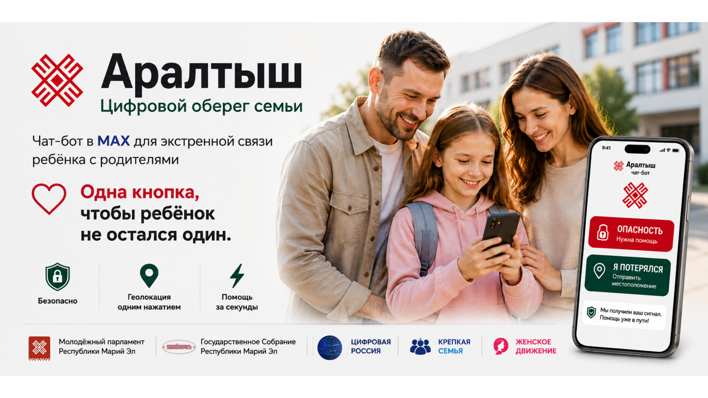

# Аралтыш



[](https://github.com/yasg1988/sos-max-bot/actions/workflows/docker-publish.yml)
[](https://www.npmjs.com/package/araltysh)
[](https://github.com/yasg1988/sos-max-bot/tags)
[](https://github.com/yasg1988/sos-max-bot/pkgs/container/sos-max-bot)
[](https://hub.docker.com/r/lmserg/araltysh)
[](https://hub.docker.com/r/lmserg/araltysh)
[](LICENSE)
[](https://www.python.org/)
[](https://fastapi.tiangolo.com/)

**Аралтыш** - чат-бот в мессенджере MAX для экстренной связи ребенка с родителями.

Ребенок нажимает одну из понятных кнопок: **Опасность** или **Я потерялся**. Родители получают тревожное сообщение и геолокацию ребенка. Сервис задуман как простой региональный шаблон: его можно развернуть в любом субъекте РФ, подключить своего MAX-бота, свою базу данных и использовать для семей, школ, кружков и общественных проектов.

## Что умеет бот

- связывает ребенка с родителями через семейную привязку;
- отправляет родителям тревожный сигнал;
- передает геолокацию ребенка, если ребенок ее отправил;
- показывает ребенку короткое меню без лишних действий;
- поддерживает роли ребенка, родителя и организации;
- хранит данные в PostgreSQL;
- работает как FastAPI webhook-сервис для MAX Bot API;
- разворачивается через Docker, Dokploy или любой сервер с Docker.

## Почему это можно масштабировать

Проект не привязан к одному региону. Для запуска в другом регионе нужно:

1. Создать нового бота в MAX.
2. Поднять PostgreSQL.
3. Развернуть Docker-контейнер.
4. Указать переменные окружения.
5. Настроить домен и webhook.
6. Заменить региональные тексты, название и визуальные материалы при необходимости.

Код остается общим, а настройки, токены, домены и база данных задаются отдельно для каждого внедрения.

## Быстрый запуск через Docker

```bash
docker build -t araltysh .
docker run --rm -p 8000:8000 --env-file .env araltysh
```

Проверка:

```bash
curl http://localhost:8000/health
```

## Переменные окружения

```env
MAX_BOT_TOKEN=
MAX_WEBHOOK_URL=https://example.ru/webhook/max
MAX_REGISTER_WEBHOOK=true
ADMIN_USER_IDS=

DB_HOST=
DB_PORT=5432
DB_NAME=postgres
DB_USER=
DB_PASSWORD=
DB_SSLMODE=disable

PORT=8000
APP_RELEASE=local
FAMILY_CODE_TTL_MINUTES=15
ORG_ALERT_COOLDOWN_MINUTES=10
```

Секреты нельзя коммитить в репозиторий. В продакшене храните их в Dokploy, GitHub Actions secrets, Docker secrets или в защищенном менеджере секретов.

## Структура

- `app.py` - основной FastAPI-сервис, webhook, меню и бизнес-логика.
- `assets/` - изображения рекомендаций и материалы интерфейса.
- `Dockerfile` - сборка контейнера.
- `.github/workflows/docker-publish.yml` - публикация Docker-образа в GHCR.
- `SERVICE_DESCRIPTION.txt` - краткое описание сервиса для презентаций и документов.

## NPM

Пакет опубликован как npm-артефакт для удобной привязки проекта к публичному каталогу и повторного использования описания/исходников:

```bash
npm install araltysh
```

Основной способ запуска в продакшене остается Docker-контейнер, потому что сам бот написан на Python/FastAPI.

## Развертывание в регионе

Рекомендуемая схема:

```text
MAX Bot -> HTTPS webhook -> Docker container -> PostgreSQL
```

Минимальный порядок работ:

1. Подготовить домен, например `sos.example.ru`.
2. Создать MAX-бота и получить токен.
3. Поднять PostgreSQL и создать отдельную базу или схему.
4. Развернуть контейнер из этого репозитория.
5. Задать переменные окружения.
6. Проверить `/health`.
7. Открыть ссылку на бота и пройти сценарии родителя и ребенка.

## Безопасность

- Не публикуйте токены MAX и пароли базы данных.
- Используйте HTTPS для webhook.
- Разделяйте базы и токены для разных регионов.
- Перед публичным запуском очищайте тестовые семейные привязки.
- Регулярно проверяйте логи webhook и ошибки доставки сообщений.

## Лицензия

Проект распространяется под лицензией [Apache License 2.0](LICENSE).

## Репозиторий

GitHub: https://github.com/yasg1988/sos-max-bot

Чат-бот: https://max.ru/araltish_bot
